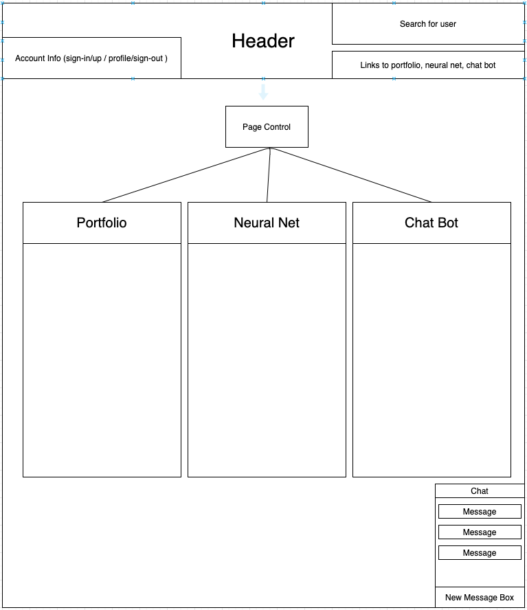

# Portfolio

#### A MERN stack app to showcase previous projects, provide an area for users to create custom profile pages with their own handwritten HTML, and the creation / teaching of an image-recognition neural net and chatbot neural net.

### Travis Scott

## Setup / Installation 

* Clone this repo down through the CLI with `git clone [URL to this repo]`

* Navigate into the server scope with `cd portfolio`, and install necessary modules with `npm i`

* Navigate into the client scope with `cd client`, and install necessary modules with `yarn`

* Navigate back up into the server scope with `cd ..`, and start the application with `npm run dev` to start both server and client

* Go to `localhost:3000` to see the client side application.

## Basic Diagram

### MVP

* React client, with views for a landing page, portfolio, neural net training area, chat bot, and user profiles

* Auth (maybe with passport.js) for users, CRUD functionality for user accounts/profile pages

* Portfolio view with links to other projects

* Profile control: textbox view, letting the user write HTML, and a page view, rendering what the user has written (sanitize and dangerously set inner HTML?)

* MongoDB saving user profiles 

* Ability to search by username and view existing users' pages

* Neural net view -- users can upload pictures, and give keywords describing the subject. Other option, add a scraper to pull pics from the internet, with a guess for an applicable keyword, users confirm or deny. Details below. Images, keywords, and weights/biases of network stored separately in DB. Maybe scrape Wikipedia articles?

* Live chat: anonymous option, or logged in. Web sockets! Chats stored in db, used to train chat bot?

* Chat bot view, 1 on 1 users with bot. Random returns, uses chat to guess acceptable responses, maybe users rate how valid a response is to determine cost? Another neural net. 

### Server / API

* CRUD and auth for accounts

* CRUD for profile pages

* CRUD for portfolio pieces? Maybe hardcoded, but dynamic would be nice.

* Socket.io for livechat

* Neural net TBD. Probably processed client-side and deltas for weights and biases sent to servers, along with new images and keywords?

### Neural Net Strategy?

* On user upload: compress images to standard size, store image and keyword in DB. 

* Many-to-many relationship between keywords and images? 

* Keywords would have to be translated to ints. Neural network returns a numerical value, it searches the int-keyword hash for a match, returns corresponding keyword. New keywords get a new index in the hash, if a picture is assigned an existing keyword, it will have an expected value of that keyword's index.

### License
MIT